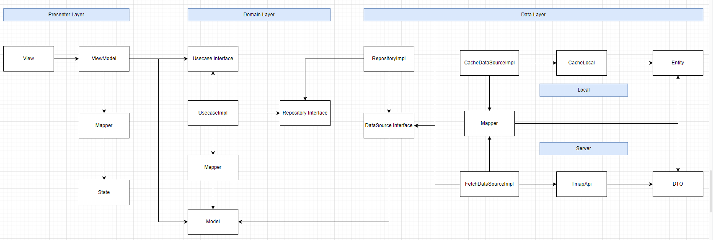

 

# Introduction

사용자의 디바이스의 보행계수기 센서에서 실시간 걸음수를 수집하여,

일, 월, 년간 데이터를 차트로 목표치 대비 걸음수를 칼로리(kcal), 거리(km), 시간(분) 으로 변환하여 함께 보여줍니다.

다른 사용자들과 한달 동안의 걸음수로 경쟁할 수 있으며,

일정 걸음수를 달성할 때 마다 해당되는 미션들을 클리어 함으로써

단순한 걷기를 넘어서 좀 더 재미를 담아 건강 관리에 도움을 주는 앱 입니다.

# Operations

- **걸음수 수집** : 사용자는 실시간으로 수집된 걸음수를 바탕으로 칼로리(kcal), 거리(km), 시간(분) 단위로 변환하여 시각화 된 차트(chart) 로 세분화 하여 볼 수 있다.
- **랭킹 기능** : 다른 사용자들과 한달 동안의 걸음수에 대해 경쟁할 수 있고, 친구 추가를 하여 친구관계로 따로 분류해서 볼 수 있다.
- **미션 기능** : 사용자는 실시간으로 수집된 걸음수를 바탕으로 만들어진 미션들의 조건에 충족하면 “미션 클리어 알림” 을 수신하고, 해당 미션의 보상으로 경험치와 칭호를 획득할 수 있으며 완성된 미션과 미완성 미션을 확인할 수 있다.
- **내 정보 변경** : 사용자의 신체 정보, 닉네임 과 미션 달성시 획득한 칭호들을 변경할 수 있고, 로그아웃과 회원탈퇴를 수행할 수 있다.

# Stacks

| Category | Lib |
| ----- | ----- |
| Language | Kotlin |
| UI toolkit | Compose |
| Android | Activity, Service, Lifecycle, Compose-Navigation, HealthConnect, AlarmManager, WorkManager |
| Asynchronous | Kotlin.Coroutines, Kotlin.Coroutines.Flow |
| Dependency Injection | Hilt |
| Data | Room, DataStore(proto3), Retrofit2 & Okhttp3 |
| Unit Test | Junit, Kotest, mockk |

# Structure

> Clean & MVVM & UDF

 

# Member

> **황진호 ([jowunnal](https://github.com/jowunnal "github link"))** 

> **공경일 ([kyungil9](https://github.com/kyungil9 "github link"))** 

 

| 황진호 | 공경일 |
| ----- | ----- |
| 걸음수 수집 & 홈 화면, 랭킹 화면 | 미션 화면, 내정보 화면 |
